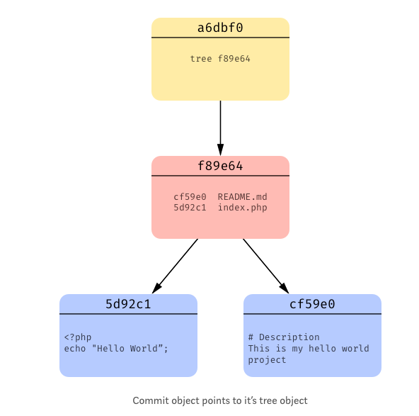

## 概念、数据结构

* commit
  * 包含commit message，author, committer
  * author (写代码的人) v.s. committer (把代码添加到项目的人): git am &lt;xxx.patch
  * git cat-file commit &lt;xxx&gt;
* tree
  * 文件夹，包含文件和嵌套文件夹的引用
  * git ls-tree &lt;xxx&gt;
* blob (binary large object)
  * 文件，snapshots of our files
  * git cat-file blob &lt;xxx&gt;

## 常用操作
* git help &lt;子命令&gt;
* log
  * commit范围符号：.. vs ...
    * a..b表示b可达a不可达的全部commit
    * a...b表示a可达或b可达但是不是ab都可达的全部commit
  * --author=&lt;author&gt; --comitter=&lt;committer&gt; --since='4 days ago' --until='1 days ago'
  * 在终端里展示分支
  > git log --color --graph --pretty=format:'%Cred%h%Creset -%C(yellow)%d%Creset %s %Cgreen(%cr) %C(bold blue)<%an>%Creset' --abbrev-commit

  > git log --branches --remotes --tags --graph --oneline --decorate --color --abbrev-commit  --pretty=format:'%Cred%h%Creset -%C(yellow)%d%Creset %s %Cgreen(%cr) %C(bold blue)<%an>%Creset'
* repo
  * git remote add &lt;repo-name&gt; &lt;repo-url&gt;
  * git remote remove &lt;repo-name&gt;
  * git remote set-url &lt;repo-name&gt; &lt;repo-url&gt;
  * remote tracking
    * 远端仓库在本地的镜像，&lt;repo-name&gt;/&lt;branch-name&gt;，用git fetch同步tracking分支
* commit
  * staging area
    * 三种存储状态：fs(worktree) -> staging -> commit
    * fs状态的文件改动，如果丢失了不能通过git找回，其他状态的数据可以
    * git diff [--cached], 不加选项时展示fs相对于staging的差异，加--cached时展示的是staging相对于commit的差异
  * git add [-u]
  * git commit [-m]
  * git stash [pop|drop|list]
  * git checkout path # 丢掉path及子目录的文件系统中的改动，检出staging（如果有的话）或当前commit到文件系统
* branch/tag
  * branch相当于指针，可以指向不同的commit，比如：提交代码，merge，rebase，reset等操作
  * tag相当于常指针，只能指向固定的某个commit
  * git branch a b # 创建新分支a，指向b（branch, commit, tag）
  * git branch -m new_branch_name
  * git reset [--hard] [refspec]
  * git rebase a b
    * 把b相对于a的的改动移动到a下面
    * 每个commit合并一次
  * git merge a
    * 合并a分支的改动到当前分支
    * 只有一次合并
* diff/difftool
  * git diff a b # 展示b和a的差异
  * git diff a...b # 展示b和a与b最近共同祖先commit(git merge-base a b)的差异

* mergetool
  * 冲突时执行git mergetool
## 推荐书目
* progit
